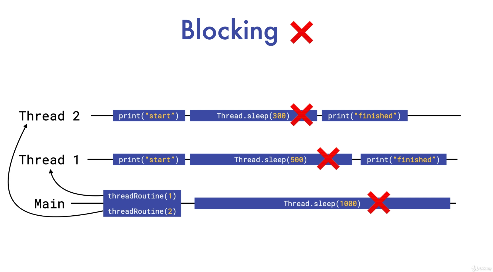
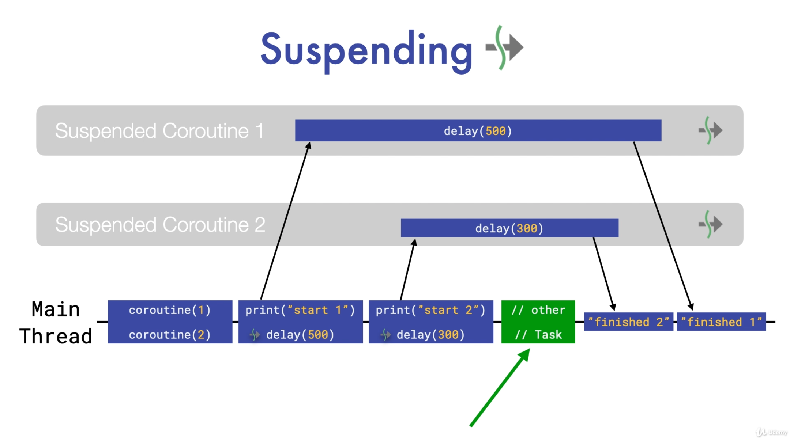

## 4. Blocking vs Suspending

### Blocking이란 무엇인가? - Thread와 관련하여
* Thread의 실행을 멈추는 것
* Thread가 Block되는 동안, 해당 Thread에서는 "아무것도 할 수 없음을" 의미

```
fun main() {
    println("main starts")
    threadRoutine(1, 500)
    threadRoutine(2, 300)
    Thread.sleep(1000) // blocked for 10s
    println("main ends")
}

// routine 생성 = kotlin에서의 일반적인 함수
fun threadRoutine(number: Int, delay: Long) {
    thread {
        println("Routine $number started to work")
        Thread.sleep(delay)
        println("Routine $number finished")
    }
}
```



* main 함수는 2개의 threadRoutine이 완료되는 것을 보장할 수 있는 시간인 10초 동안 아무것도 할 수 없다.
* 이는 매우 비효율적으로, 안드로이드의 Main(UI) Thread에서 이러한 식으로 구현한다면 사용자 경험을 크게 해치며 ANR이 발생

### Suspending이란 무엇인가? - Coroutine과 관련하여
* Thread가 아닌 Thread에서 마련되거나 호출된 coroutine scope / suspend function이 '일시 정지'되는 것
* 이것은 Thread를 멈추게 하지 않기 때문에 suspend 시에는 Thread에서 다른 작업을 얼마든지 수행할 수 있다.
```
fun main() = runBlocking {
    println("main starts")
    joinAll(
        async { 
            coroutineWithThreadInfo(1, 500) // suspend
        },
        async { 
            coroutineWithThreadInfo(2, 300) // suspend
        },
        // suspend : 다른 scope를 마련하여 다른 일을 할 수 있음
        // suspend는 Thread를 block하는 것이 아니기 때문
    )
    println("main ends")
}

suspend fun coroutineWithThreadInfo(number: Int, delay: Long) {
    println("Coroutine $number starts working ${Thread.currentThread().name}")
    delay(delay) // 
    println("Coroutine $number ends")
}
```

```
fun main() = runBlocking {
    println("main starts")
    joinAll(
        async {
            suspendingCoroutine(1, 500)
        },
        async {
            suspendingCoroutine(2, 300)
        },
        async {
            repeat(5) {
                println("other task is working on ${Thread.currentThread().name}")
                delay(100)
            }
        }
    )
    println("main ends")
}

suspend fun suspendingCoroutine(number: Int, delay: Long) {
    println("Coroutine $number starts working ${Thread.currentThread().name}")
    delay(delay) // Thread의 sleep 대신 delay 활용
    println("Coroutine $number ends")
}
```



* 그림과 첫 강의에서 언급하였던 제어흐름의 변화와 연관지어 잘 생각해보기
  * 위의 그림과 같이 진행될 수 있는 이유는 코루틴의 경우, 코루틴 scope 시작과 동시에 제어 흐름이 다시 호출 함수로 넘어온다는 것에 기인
  * Thread가 멈추는 것이 아니라, 해당 suspend function을 호출한 함수가 멈추는 것이므로 suspend function이 멈춰있는 동안 Thread는 얼마든지 다른 작업을 진행할 수 있음
  * 그 이유로, 안드로이드에서 Main Thread라고 하더라도 suspend function을 실행하는 것이 문제가 되지는 않음